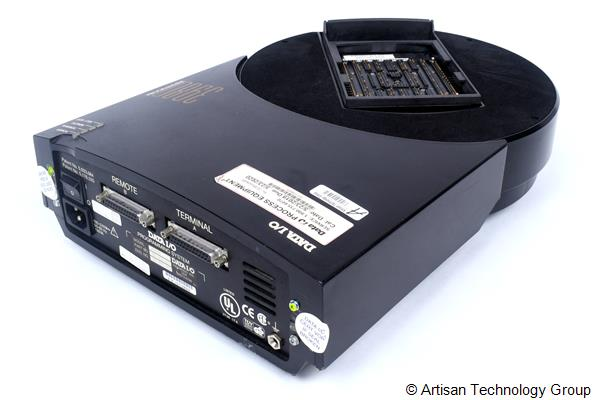

# GM ATEC EPROM PROGRAMMER

Technical Products Group - General Motors Production ATEC EPROM Programmer

## Description
The **ATEC EPROM Programmer** is a software application designed to program EPROM modules in a high-volume manufacturing environment using the DataIO 3980 series of EPROM programmers. It features a user-friendly interface and supports diagnostics and troubleshooting for EPROM programmers and thermal label printers. The user manual is located in the "Docs" folder and provides comprehensive instructions for installing, configuring, and using the ATEC EPROM Programmer, along with troubleshooting and technical reference information. If you have any specific questions or need further details, feel free to ask!

### Key Features
- **Main Menu Interface**: Easy to use, no mouse required.
- **Status Display**: Shows the status of EPROM programmers and printers.
- **Event History**: Logs every action taken.
- **Diagnostics**: Complete diagnostics for EPROM programmers and printers.
- **Troubleshooting Log**: Helps in identifying and resolving issues.
- **Compatibility**: Supports Microsoft Windows XP and Vista.

### User Interface
- **Windows Menu**: Provides file and view options.
- **Main Menu**: Identical to the DOS-based ATEC system, allowing selection of options using the keyboard or mouse.
- **Hardware Status**: Displays the connection status of programmers and printers.
- **Settings**: Shows current program settings.
- **Event History**: Logs actions taken during the session.

### Installation
1. **Norton Ghost 12.0**: For system backup and recovery, sold seperately.
2. **Diskeeper 2008**: For disk defragmentation, sold seperately.
3. **Intermec PrintSet 4**: For configuring Intermec printers, sold seperately.

### Using ATEC
- **Starting the Program**: Can be started from the Windows Start menu or desktop icon.
- **Hardware Status**: Displays the connection status of programmers and printers.
- **Settings**: Allows changing EPROM type and viewing data file information.
- **Converting Data Files**: Converts data files to Motorola format.
- **Programming EPROMs**: Burns EPROMs and optionally prints labels.
- **Printing Labels**: Prints labels using connected printers.
- **Ending the Session**: Exits the program and returns to Windows.

### Technical Reference
- **System Requirements**: Specifies hardware and software requirements.
- **File Locations**: Details the directory structure and file locations.
- **Settings File**: Describes the XML configuration file used for storing settings.
- **Motorola Format File Specification**: Provides details on the format used for EPROM programming.

## Hardware
The ATEC software can program devices on two DataIO 3980 simultaneously via RS-232 serial communications:

The ATEC software can print thermal barcode labels on two Intermec PF2i label printers simultaneously via RS-232 serial communications:

The ATEC main screen:

